Hizmet Kap – Kişiye Özel Hizmet İlan Platformu

Hizmet Kap, kullanıcıların ihtiyaçlarına göre ilan oluşturabildiği, yönetebildiği ve hizmet değerlendirmesi yapabildiği bir web uygulamasıdır.

🚀 Özellikler

Kullanıcılar kendi ilanlarını oluşturabilir ve yönetebilir (aktif/pasif, ilan süresi, konum, telefon).

İlan üzerinde doğrudan mesajlaşma ve sohbet geçmişini silebilme.

Kullanıcılar aldıkları hizmetleri değerlendirebilir ve yorum bırakabilir.

Gerçek zamanlı mesajlaşma sistemi (Socket.IO).

Responsive ve modern tasarım (Tailwind CSS ve Material UI).

Güvenli giriş ve kayıt sistemi (JWT ve bcrypt).

Konum entegrasyonu (Leaflet & React-Leaflet).

💻 Teknolojiler

Next.js 14 – React tabanlı sunucu tarafı render ve SEO uyumlu sayfalar

React – Modern frontend

Tailwind CSS – Hızlı ve responsive tasarım

Material UI & Icons – Kullanıcı dostu arayüz

Axios – API iletişimi

Socket.IO – Gerçek zamanlı chat

MongoDB – Veri yönetimi

React-Toastify – Bildirimler

🛠 Kullanıcı Akışı

Kullanıcı kayıt ve giriş yapabilir.

İhtiyacına göre ilan oluşturabilir, düzenleyebilir ve pasif/aktif duruma getirebilir.

İlan üzerinde mesajlaşabilir, sohbeti silebilir ve hizmeti değerlendirebilir.

Her ilan kullanıcıya özel olarak görüntülenir ve filtrelenir.

🎨 Tasarım ve Paketler

Tailwind CSS: Responsive ve modern tasarım

Material UI: Kullanıcı dostu componentler

React-Toastify: Başarı ve hata bildirimleri

React-Leaflet & Leaflet: Harita ve konum

Axios: API istekleri

Socket.IO: Gerçek zamanlı chat

📂 Proje Yapısı
/pages
/components
/services
/public

📌 Notlar

LocalStorage ile kullanıcı ve sayfa kontrolleri yapıldı.

JWT ile güvenli oturum yönetimi sağlandı.

İlanlar ve kullanıcı verileri MongoDB üzerinden yönetiliyor.

## Arayüzler

  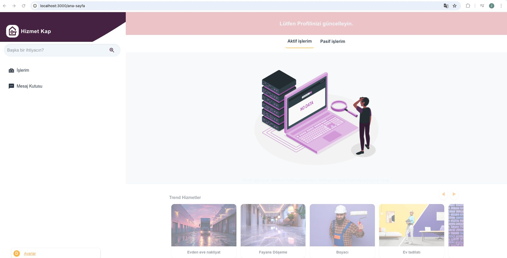

  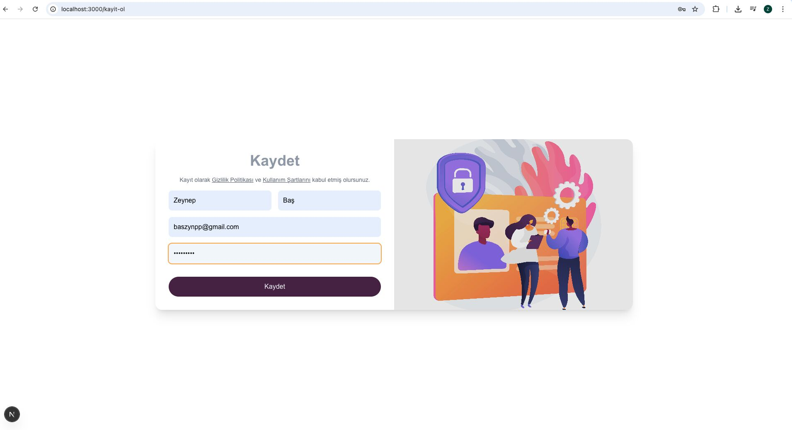

  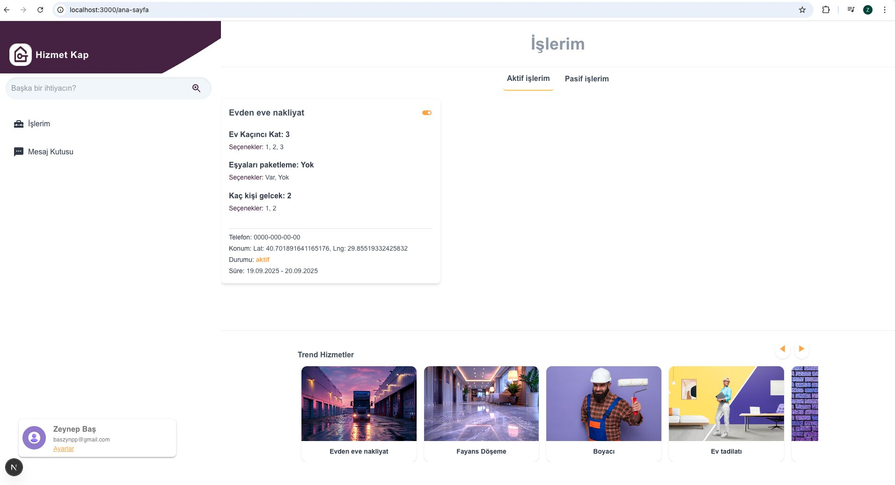

  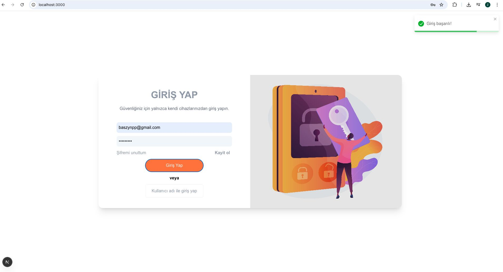

  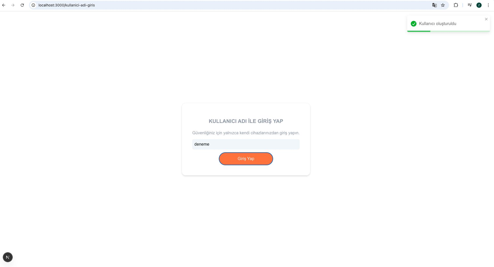

  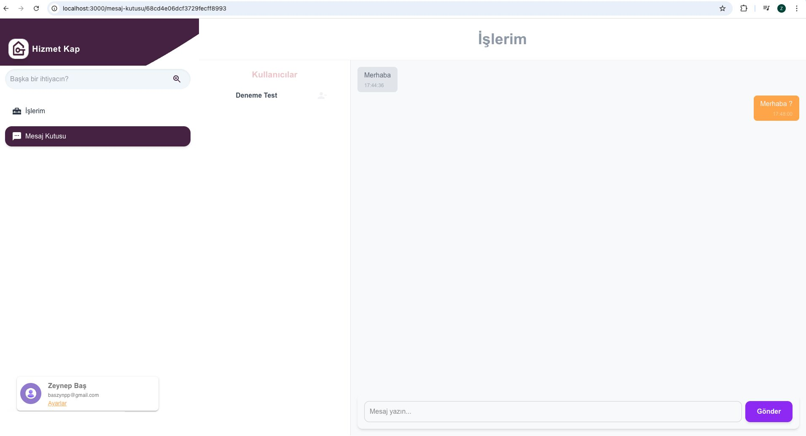

  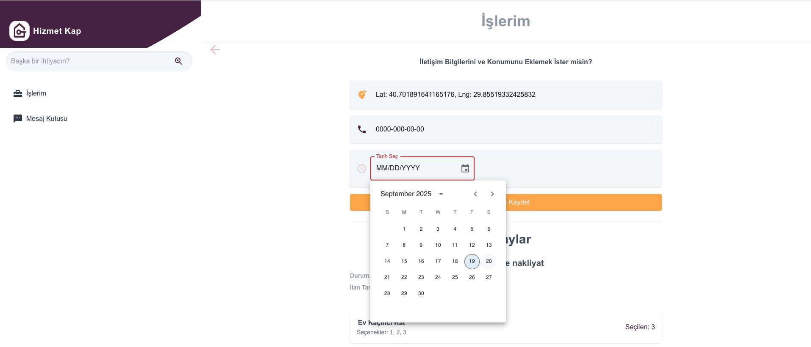

  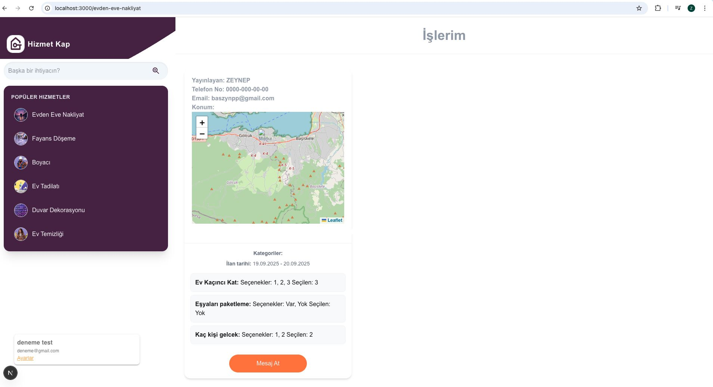

  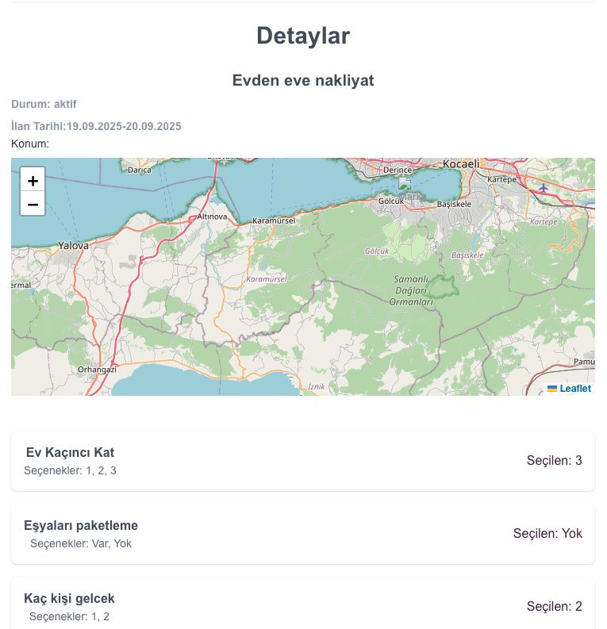

  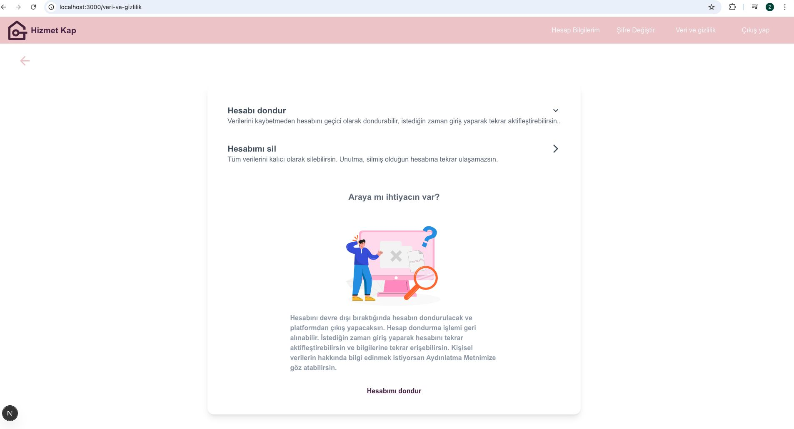

  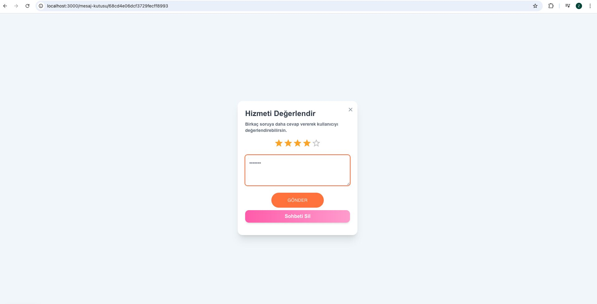

  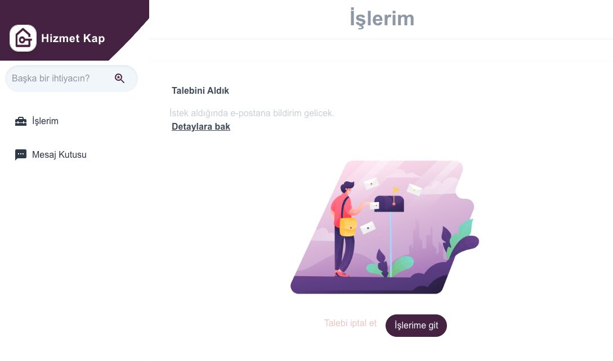

  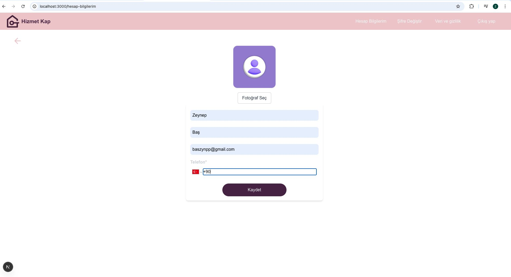

  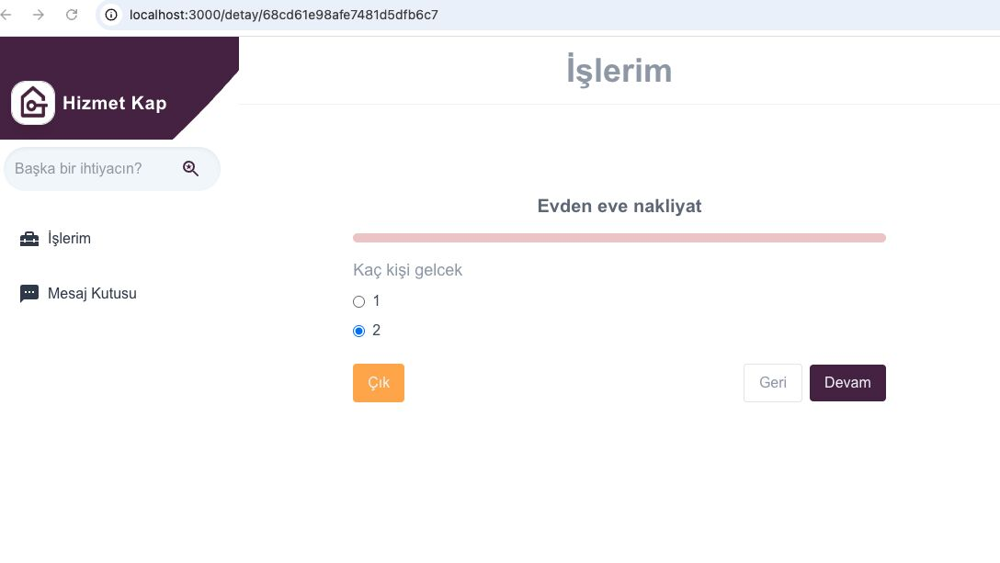

  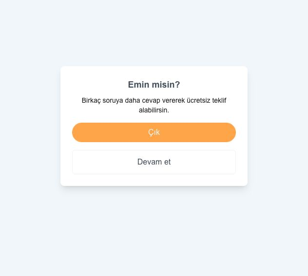

